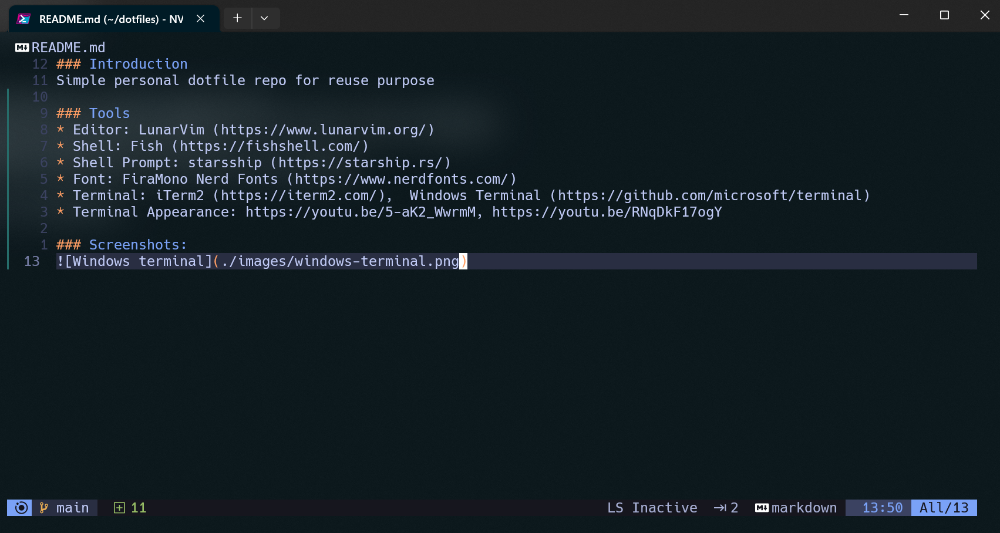
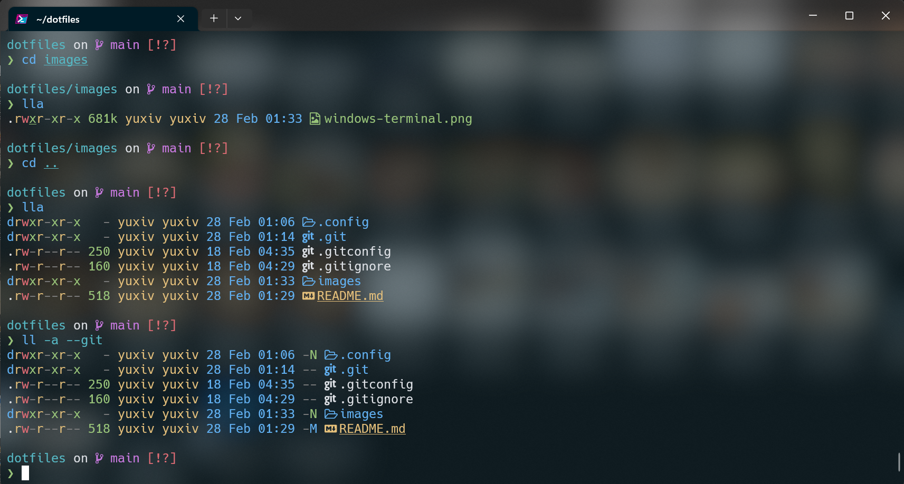

### Introduction
Simple personal dotfile repo for reuse purpose

### Tools
* Editor: LunarVim (https://www.lunarvim.org/)
* Shell: Fish (https://fishshell.com/)
* Shell Prompt: starsship (https://starship.rs/)
* Font: FiraMono Nerd Fonts (https://www.nerdfonts.com/)
* Terminal: iTerm2 (https://iterm2.com/),  Windows Terminal (https://github.com/microsoft/terminal)
* Terminal Appearance: https://youtu.be/5-aK2_WwrmM, https://youtu.be/RNqDkF17ogY

### Screenshots:

